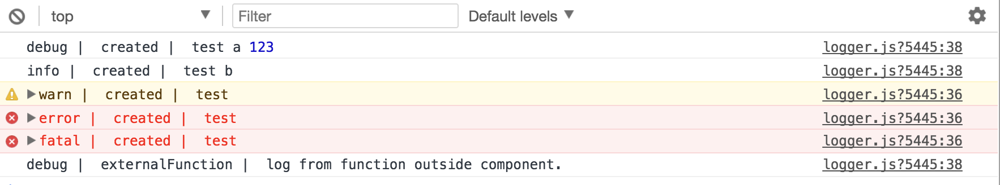

You can install `Vuejs-logger`in order to get nifty logging features for your JavaScript code. To install it, open a
terminal inside your project and enter:

```powershell
 yarn add vuejs-logger --save-exact
```

or if your are using `npm`:

```
npm install vuejs-logger --save-exact
```

## Setup logger for your project

Locate your `main.ts` and add the following entries

```typescript
// Add this to imports
import VueLogger from 'vuejs-logger'

// Add this before new Vue
const isProduction = process.env.NODE_ENV === 'production';
// Alternatively set the boolean manually, eg: const isProduction = false

const options = {
    isEnabled: true,
    logLevel: isProduction ? 'error' : 'debug',
    stringifyArguments: false,
    showLogLevel: true,
    showMethodName: true,
    separator: '|',
    showConsoleColors: true
};

// @ts-ignore
Vue.use(VueLogger, options);
```

Now, you can log anywhere like so:

```typescript
this.$log.debug('test', this.a, 123)
this.$log.info('test', this.b)
this.$log.warn('test')
this.$log.error('test')
this.$log.fatal('test')
```



## Additional Setup for Typescript

For Typescript you need to add the `vuejs logger` to typescript types. Add the following entry
to `compilerOptions → types`:

```json
"types": [
"vuejs-logger",
]
```

You can also disable Typescript Compile Errors. To do so, add a new file `$log.d.ts` to the following path:

```
src/main/frontend-ts/types/$log.d.ts
```

Then paste in the following content:

```typescript
// noinspection ES6UnusedImports
import Vue from 'vue'
import {Log} from 'vuejs-logger'

/**
 * The vuejs-logger package only defines $log for the vue instance, not for the constructor.
 * As a result, there is no way to call the logger on the Vue global. This fixes that.
 */
declare module 'vue/types/vue' {
    interface Vue {
        $log: Log;
    }

    export interface VueConstructor<V extends Vue = Vue> {
        $log: Log;
    }
}
```
