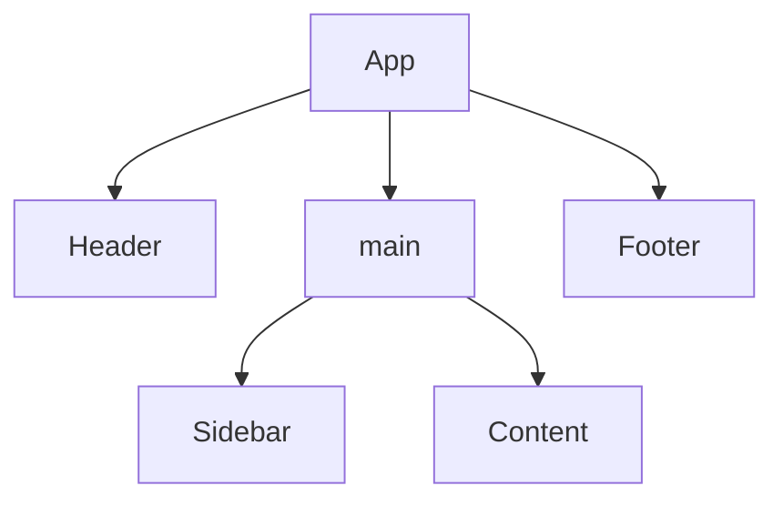

# Introduction to Vue Components

In this document, we will explore the fundamentals of Vue components, understanding their role in creating reusable UI elements. We'll dive into the anatomy of a Vue file using a practical example, learn how to create new components, and explore their hierarchical tree structure, which promotes modularity and reusability in Vue applications.

## Explanation of Vue Components

Components in Vue.js are the building blocks of a Vue application's user interface (UI). They encapsulate reusable and self-contained sections of UI logic and markup. Each component represents a distinct part of the application, such as a navigation bar, sidebar, or user profile.

To create a component in Vue, you define a template that contains the HTML markup, CSS styles, and JavaScript logic specific to that component. This encapsulation allows you to manage the UI functionality and appearance in a modular and organized manner.

By combining HTML, JavaScript, and CSS in a single file, Vue Single-File Components offer a cohesive and self-contained approach for defining components. This structure promotes better organization, readability, and maintainability of the code, making it easier to manage and develop complex Vue applications.

Components promote code reusability and maintainability. By breaking down the UI into smaller components, you can manage their behavior and appearance independently. This modular approach makes it easier to build complex interfaces and encourages a separation of concerns, as each component focuses on a specific functionality or visual element.

By leveraging the power of components, you can build modular and scalable UIs in Vue.js, where each component represents a specific UI element or functionality. This approach enhances code organization, reusability, and maintainability, enabling you to create robust and visually appealing applications.

## Example Vue File

Here's an example of a Vue Single-File Component (SFC) that demonstrates how HTML, JavaScript, and CSS can coexist in the same file:

```html
<!-- The HTML section. This is also where other Vue components are defined-->
<template>
  <div class="component">
    <h1>{{ message }}</h1>
    <button @click="incrementCount">Click me</button>
  </div>
</template>

<!-- The JavaScript section. All your logic and required Vue imports go here-->
<script>
export default {
  data() {
    return {
      message: 'Hello, Vue!',
      count: 0
    };
  },
  methods: {
    incrementCount() {
      this.count++;
    }
  }
};
</script>

<!-- The CSS section. You can refer to any components that you defined in your html.-->
<style>
.component {
  background-color: #f2f2f2;
  padding: 20px;
  border: 1px solid #ccc;
  border-radius: 4px;
}

h1 {
  color: #333;
}
</style>
```

In this example, the file has a `.vue` extension and contains three sections:

1. **Template**: The `<template>` section contains the HTML markup for the component. It defines a `<div>` element with a class of `"component"`, an `<h1>` element that displays the `message` data property, and a `<button>` element with a click event listener that calls the `incrementCount` method.
2. **Script**: The `<script>` section contains the JavaScript code for the component. It defines an object using `export default` syntax, which represents the Vue component. The `data` function initializes the `message` and `count` data properties. The `methods` object defines the `incrementCount` method, which increments the `count` property.
3. **Style**: The `<style>` section contains the CSS styles specific to the component. It applies styles to the `.component` class and the `<h1>` element within it.

## Create a new component

Here's a quick guide on how to create a new component within the main `App.vue` file in a Vue.js application:

1. Open your Vue.js project and locate the `App.vue` file. This file serves as the entry point for your application and is typically found in the `src` or `components` directory.

2. Within the `<template>` section of `App.vue`, identify the area where you want to add the new component. For example, you might want to insert it below an existing element or create a new section.

3. Define the new component by using the `<script>` tag inside the `App.vue` file. Here's an example of creating a component named `MyComponent`:

   ```vue
   <script>
   export default {
     name: 'MyComponent',
     data() {
       return {
         message: 'Hello from MyComponent!'
       };
     }
   }
   </script>
   ```

4. In the `<template>` section, use the newly created component by adding its tag within the desired location. Here's an example of using the `MyComponent` component:

   ```vue
   <template>
     <div>
       <!-- Existing code in App.vue -->
       <h1>Welcome to my Vue.js app!</h1>
       <!-- New component usage -->
       <MyComponent />
     </div>
   </template>
   ```

5. Save the changes to the `App.vue` file.

By following these steps, you have successfully created a new component within the main `App.vue` file. The component is defined using the `<script>` tag, and you can use it in the `<template>` section by adding its tag wherever you want it to appear. This approach allows you to create and integrate components within the main app file, making it easier to manage and structure your Vue.js application.

## Tree Structure of Components

In Vue.js, components form a hierarchical tree structure, where parent components encapsulate and contain child components. This tree structure is based on the parent-child relationship between components and reflects the organization and composition of the user interface (UI). At the root of the tree is typically the main Vue instance, which represents the entire application. The main Vue instance serves as the root component and can contain multiple child components.

As the application grows, components are nested within each other, forming a tree-like structure. Each component can have its own template, data, methods, and lifecycle hooks. Child components can receive data from parent components via props and emit events to communicate changes back to the parent components. Here's an example to illustrate the component tree structure:

```vue
<!-- App.vue with nested child componenets -->
<template>
  <div id="app">
    <Header/>
    <div id="main:">
      <Sidebar/>
      <Content/>
    </div>
    <Footer/>
  </div>
</template>

<script>
import Header from './components/Sidebar.vue';
import Sidebar from './components/Sidebar.vue';
import Content from './components/Content.vue';

export default {
  name: 'App',
  components: {
    Sidebar,
    Content
  },
  data() {
    return {
      title: 'My Vue App'
    };
  }
};
</script>
```

In this example, the `App` component serves as the root component. It contains the `header`, `main`, and `footer` sections, which are child components. The `App` component also imports and registers the `Sidebar` and `Content` components as its child components using the `components` property.

The `Sidebar` and `Content` components are further nested within the `main` section of the `App` component. They can have their own template, data, and methods, allowing for encapsulation and reusability.

This hierarchical structure allows for composition and separation of concerns in Vue.js applications. It enables you to break down complex UIs into smaller, manageable components, each responsible for its specific functionality. The component tree structure facilitates communication and data flow between components, making it easier to develop and maintain Vue.js applications.

Here's a tree view representation of the component structure in the example:



In this tree view, each component is represented by its component name or HTML element. The indentation represents the nesting hierarchy, with the child components indented beneath their parent components. Here's a breakdown of the component tree structure based on the example:

- `App` is the root component.
  - `header` is a child component of `App`.
    - `h1` is a child component of `header`.
  - `main` is a div that contains child components.
    - `Sidebar` is a child component of `main`.
    - `Content` is a child component of `main`.
  - `footer` is a child component of `App`.
    - `p` is a child component of `footer`.


